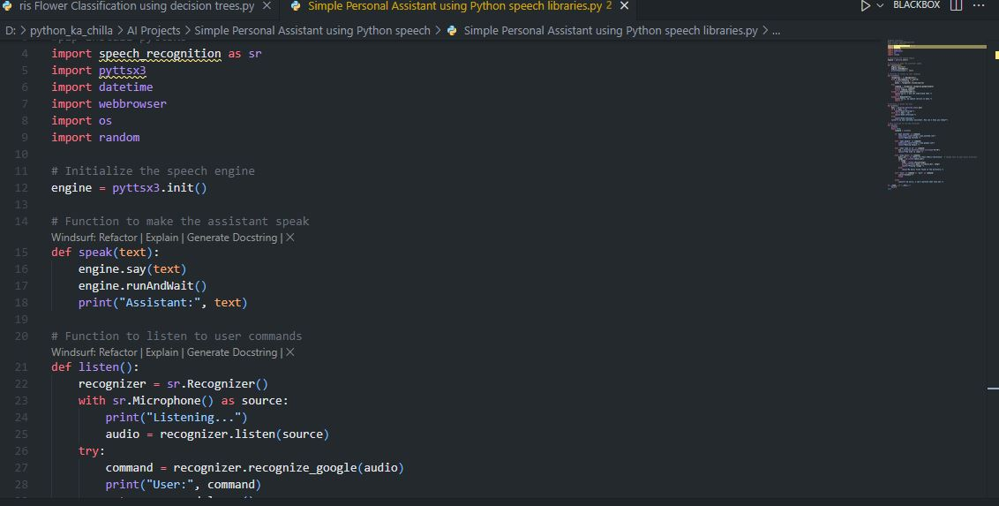
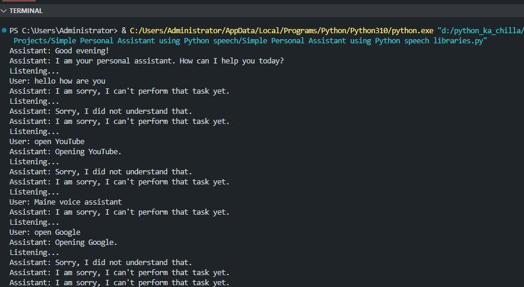

# 🗣️ Simple Personal Assistant using Python Speech Libraries 🤖  
    

<p align="center">
  
</p>

🚀 A lightweight, voice‑controlled personal assistant written in Python. It listens to your commands, speaks back, and can perform basic tasks like opening websites, telling the time, playing random music from a folder, and greeting you based on the time of day. Built with `speech_recognition` and `pyttsx3`.

---

## ✨ Key Features  
🎙️ **Voice Recognition** – Listens and understands spoken commands  
🗣️ **Text‑to‑Speech** – Responds with a natural‑sounding voice  
👋 **Time‑based Greetings** – Says good morning/afternoon/evening  
🌐 **Open Websites** – Launches YouTube, Google, etc. on command  
⏰ **Tell the Time** – Announces the current time  
🎵 **Play Music** – Plays a random song from a specified folder  
🚪 **Exit Command** – Ends the conversation politely  

---

## 🧠 Tech Stack  
- **Language:** Python 🐍  
- **Libraries:** `speech_recognition`, `pyttsx3`, `datetime`, `webbrowser`, `os`, `random`  
- **Recommended IDE:** VS Code / PyCharm 💻  

---

## 📦 Installation  


```bash
git clone https://github.com/SayabArshad/Personal-Assistant-Python-Speech.git
cd Personal-Assistant-Python-Speech
pip install SpeechRecognition pyttsx3
```

⚙️ Note: You may need to install additional system dependencies for microphone access (e.g., PyAudio on Windows/Linux). Refer to the speech_recognition documentation for details.

---

## ▶️ Usage

Update the music directory path in the script (replace C:\\Path\\To\\Your\\Music\\Directory with your own music folder).

Run the assistant:

```bash
python "Simple Personal Assistant using Python speech libraries.py"
```

Speak your commands after the "Listening..." prompt. Example commands:

"Open YouTube"

"Open Google"

"What time is it?"

"Play music"

"Exit" or "Quit"

---

## 📁 Project Structure

```
Personal-Assistant-Python-Speech/
│-- Simple Personal Assistant using Python speech libraries.py  
│-- README.md                                                    
│-- assets/                                                       
│    ├── code.JPG
│    └── output.JPG
```
---


## 🖼️ Interface Previews

| 📝 Code Snippet | 📊 Console Output |
|:---------------:|:-----------------:|
|  |  |

---

## 💡 About the Project

This project is a beginner‑friendly introduction to building a voice‑controlled assistant using Python. It leverages speech_recognition to capture and interpret user commands, and pyttsx3 for text‑to‑speech output. The assistant can greet the user based on the time of day, open popular websites, tell the current time, play a random song from a directory, and gracefully exit. The code is well‑structured and easy to extend – you can add new commands by simply adding more if-elif blocks.

---

## 🧑‍💻 Author

Developed by: Sayab Arshad Soduzai 👨‍💻
📅 Version: 1.0.0
📜 License: MIT License

---


## ⭐ Contributions

Contributions are welcome! Fork the repository, open issues, or submit pull requests to enhance functionality (e.g., adding more commands, improving error handling, or integrating with APIs).
If you find this project helpful, please ⭐ star the repository to show your support.

---

## 📧 Contact

For queries, collaborations, or feedback, reach out at sayabarshad789@gmail.com

---

🗣️ Your voice, your command – a simple assistant at your service.


---
